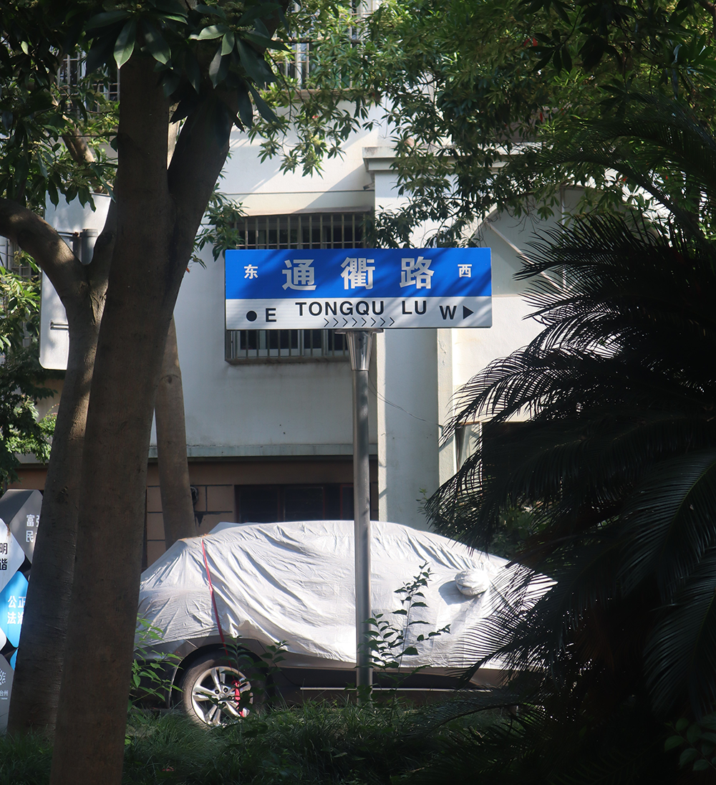

# 椒江老城区摄影 第一辑
## 前言

  

椒江，台州话读作 "Tsiao-kông"，是台州的Downtown Area。他既有初具繁华摸样的商务区，也有一些陈旧的、萧条的、被遗忘的老城区，后者是我长大的地方。尽管椒江的城市风光无特色可言，但他包含了许多椒江人的共同记忆。利用相机记录下取之无禁的光的信息，以后回忆时也可以减少脑力的耗费。  

摄影器材为Canon M50 Mark I 和一个15-45mm变焦镜头。摄影技术一般，后期有较多调整。
## 摄影

